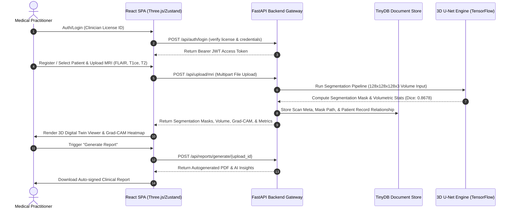

# 🧠 NeuroTwinAI-Lite
### **Digital Twin-Based AI System for Brain Tumor Insight**

---

<p align="center">
  
  
  
</p>

<p align="center">
  
  
  
  
  
  
  
</p>

---

## 🏛️ Academic Institutional Details
* **Project Type:** Final Year Project (FYP)
* **University:** Capital University of Science & Technology (CUST), Islamabad, Pakistan
* **Supervisor:** Dr. Sabeen Masood
* **Developer:** Abdul Rafay ([@Mr-Abdul-Rafay](https://github.com/Mr-Abdul-Rafay)) — Full-Stack Developer (FYP Solo Project)

---

## 📌 Project Overview
**NeuroTwinAI-Lite** is a full-stack, clinical-grade intelligence platform that simulates a state-of-the-art neurological digital twin system. It bridges deep learning medical imaging pipelines with modern, immersive frontends to enable radiologists and neurosurgeons to:
1. **Upload Multi-Modal MRI Scans** (FLAIR, T1ce, T2) in raw medical formats.
2. **Execute a 3D U-Net Segmentation Pipeline** to isolate brain tumors with sub-millimeter precision.
3. **Interact with 3D Neurological Digital Twins** featuring dynamic tumor layer visualization in WebGL.
4. **Monitor Simulated Patient Vitals & EEG Telemetry** in real-time.
5. **Generate Automated AI Clinical Reports** and manage historical patient records under HIPAA-aligned design patterns.

---

## ⚙️ Core Clinical Workflow
Below is the system-level workflow mapping how clinical telemetry, MRI scans, and AI models interface:



---

## ✨ Features Implemented

### 1. 🤖 AI-Powered Tumor Segmentation
* **Architecture:** Custom **3D U-Net** optimized for spatial contextual learning in MRI volumes.
* **Model Parameters:** **5.65 Million parameters**, striking an ideal balance between deep feature extraction and fast CPU inference.
* **Dataset & Performance:** Trained on the benchmark **BraTS 2021** (Brain Tumor Segmentation Challenge) dataset.
  * **Whole Tumor Dice Score:** **0.8678**
  * **Enhancing Tumor Dice Score:** **0.6487**
* **Input Volume:** Multi-modal support accepting co-registered inputs: **FLAIR, T1ce, and T2** (Input shape: `128 × 128 × 128 × 3`).
* **Multi-Class Output:** Classifies voxels into four categories:
  * Class 0: Background
  * Class 1: Necrotic/Non-Enhancing Tumor Core (NCR/NET)
  * Class 2: Peritumoral Edema (ED)
  * Class 3: GD-Enhancing Tumor (ET)

### 2. 🌐 3D Digital Twin Viewer
* **Technology:** WebGL rendering powered by **Three.js** and `@react-three/fiber` / `@react-three/drei`.
* **Features:**
  * Interactive 3D brain mesh with semi-transparent anatomical regions.
  * Precise tumor overlays mapping the coordinates generated by the segmentation backend.
  * Fluid orbit controls (rotate, zoom, pan) with view presets (Sagittal, Coronal, Axial).
  * **Export formats:** Export custom digital twin models as **GLTF, OBJ, or STL** meshes for medical printing or external visualization.

### 3. 📤 MRI Upload & Pipeline Processing
* **Pipeline:** Accepts raw medical imaging formats (FLAIR, T1ce, T2).
* **Processing:** Features a robust real-time async pipeline. Files are safely parsed, resized, normalized, and queued.
* **UX:** Real-time upload progress bars and status trackers ("Queued", "Processing", "Completed") communicating via API status updates.

### 4. 🔍 Explainable AI (Grad-CAM & XAI)
* **Heatmap Overlays:** Visualizes model focus areas by generating Grad-CAM heatmaps showing which anatomical features directed the network's prediction.
* **Explanations:** Automatic text explanation engine that translates mathematical confidence and volumetric data into clinical statements for patient-clinician communication.

### 5. 👥 Patient Management (CRUD)
* Full relational patient registry including demographic details, clinical history, and symptoms.
* Search and filter systems tailored for clinic registries.
* Relates patient records directly to scan history and generated reports.

### 6. 📋 AI Clinical Reports
* **Generation:** Generates professional, download-ready PDF reports with a single click.
* **Contents:** Incorporates patient demographics, tumor volumetric analytics (in $cm^3$), classifier confidence percentages, multi-class segmentation breakdown, and clinical action plans.

### 7. 📡 Real-Time IoT Monitoring
* Simulates live patient telemetry inside the clinic.
* **EEG Simulator:** Multi-channel EEG waveform tracker (Fp1, Fp2, C3, C4) powered by Recharts, simulating active brain signals.
* **Vitals Grid:** Live-updating values for Heart Rate (BPM), SpO₂ (Oxygen Saturation), and Body Temperature (°C) with an alert system highlighting critical anomalies.

### 8. 📊 Clinical Dashboard & Analytics
* Comprehensive KPI dashboard featuring total statistics, active system queues, critical patient counts, and HIPAA compliance verifications.
* Dynamic AI insight feed broadcasting real-time diagnostics updates across the clinical instance.

---

## 🛠️ Tech Stack

### Backend
* **Python 3.11+** – Core programming language.
* **FastAPI 0.115** – High-performance asynchronous REST API framework.
* **TensorFlow 2.15** – Deep learning execution engine (CPU-optimized float32 policy).
* **TinyDB 4.8** – Minimalist, document-based JSON store for zero-friction database setup.
* **Uvicorn 0.24** – Fast ASGI server implementation.
* **Nibabel 5.1** – Python medical imaging toolkit for parsing NIfTI/DICOM volumes.
* **Scikit-image 0.21** – Image processing utilities (e.g., Marching Cubes for 3D mesh reconstruction).

### Frontend
* **React 19** – Component-based frontend library.
* **Three.js r160** – 3D rendering library.
* **Tailwind CSS 3.4** – Utility-first CSS framework for modern design aesthetics.
* **Zustand 4.5** – Lightweight, robust client-side state store.
* **React Query 5.0 (TanStack Query)** – Server-state synchronization, request caching, and query management.
* **Vite 5.0** – Fast frontend tooling and dev server.

---

## 📂 Project Structure

```
NeuroTwinAI-Lite/
├── backend/
│   ├── app/
│   │   ├── routes/
│   │   │   ├── upload.py         # [POST/GET] MRI file upload & statistics APIs
│   │   │   ├── inference.py      # [POST/GET] 3D U-Net segmentation core endpoints
│   │   │   ├── viz.py            # [POST] Marching Cubes -> 3D GLTF mesh generator
│   │   │   ├── patients.py       # [CRUD] Patient registry database controllers
│   │   │   └── reports.py        # [POST/GET] AI Clinical PDF report managers
│   │   ├── services/
│   │   │   └── model_service.py  # TensorFlow model loader & volume prediction utilities
│   │   ├── auth.py              # JWT token signature & bcrypt hashing engine
│   │   ├── database.py          # TinyDB database schemas, seed data & tables configuration
│   │   ├── main.py              # FastAPI app initializer, CORS, & auth routers inclusion
│   │   ├── test_api.py          # Backend test coverage module
│   │   └── db.json              # Active clinical data store
│   ├── models/
│   │   ├── best_model.h5        # Original pre-trained 3D U-Net model (~65MB)
│   │   └── best_model_float32.h5# Converted float32 model for general CPU compatibility
│   ├── convert_to_float32.py    # Utility script converting model layers from FP16 to FP32
│   ├── clear_all_uploads.py     # Utility script to clean up temporary uploads and masks
│   └── requirements.txt         # Complete backend python dependencies list
│
└── frontend/
    ├── src/
    │   ├── api/                 # Axios-based API service calls
    │   ├── assets/              # Static UI assets (hero images, model renders)
    │   │   ├── brain_graphic.jpg
    │   │   ├── hero.png
    │   │   └── login_design_ss.png
    │   ├── components/          # Reusable React components
    │   │   ├── Brain3D.jsx      # Three.js 3D WebGL renderer for brain structures
    │   │   ├── BrainVisual.jsx  # Interactive SVG representation of brain hemispheres
    │   │   ├── ui/              # Atom/Design UI elements (GlassCard, Sidebar, TopNav)
    │   │   └── PrintReport.jsx  # PDF printable rendering target component
    │   ├── context/
    │   │   └── PatientContext.jsx # Global context providing active patient operations
    │   ├── hooks/               # Custom hooks for upload pipeline and cleanup jobs
    │   ├── pages/               # Views inside the app shell
    │   │   ├── DashboardPage.jsx      # Aggregated metrics, vitals panels, recent feed
    │   │   ├── TwinViewerPage.jsx     # 3D Digital Twin environment & controls
    │   │   ├── AIResultsPage.jsx      # Slice-by-slice scan analysis and tumor classifications
    │   │   ├── MRIUploadPage.jsx      # File queueing and upload execution terminal
    │   │   ├── IoTMonitoringPage.jsx  # Real-time multi-channel EEG & telemetry dashboard
    │   │   ├── PatientDirectoryPage.jsx # Full-featured clinical patient CRUD directory
    │   │   ├── ReportsPage.jsx        # Clinical report generation center
    │   │   ├── LoginPage.jsx          # Security gateway portal for licensed clinicians
    │   │   └── RegisterPage.jsx       # Access request & HIPAA agreement registration
    │   ├── store/               # Zustand global store configuration
    │   ├── App.jsx              # Routing and navigation hub
    │   └── main.jsx             # React DOM root bootstrapping
    ├── vite.config.js           # Vite bundle configuration
    └── package.json             # Frontend JavaScript dependencies list
```

---

## ⚡ API Endpoint Catalog

All routes are prefix-grouped and secure-gated using **Bearer JWT Tokens** unless marked with a public access tag (🔓).

| HTTP Method | Route Endpoint | Auth Status | Description |
|:---|:---|:---|:---|
| **POST** | `/api/auth/register` | 🔓 Public | Clinician account sign-up & licensing validation |
| **POST** | `/api/auth/login` | 🔓 Public | Authenticate clinician credentials; return JWT |
| **GET** | `/api/health` | 🔓 Public | Liveness probe inspecting 3D model status & system integrity |
| **GET** | `/api/dashboard/data` | 🔑 Secure | Fetches global KPI tiles, upload histories, and insights |
| **POST** | `/api/upload/mri` | 🔑 Secure | Multi-part upload for FLAIR/T1ce/T2 files to execute pipeline |
| **GET** | `/api/upload/recent` | 🔑 Secure | Retrieves list of the 5 most recent MRI scan uploads |
| **GET** | `/api/upload/stats` | 🔑 Secure | Aggregates data on processing volumes and classification counts |
| **POST** | `/api/inference/segment` | 🔑 Secure | Initiates 3D U-Net segmentation on a specified upload ID |
| **GET** | `/api/inference/result/{upload_id}`| 🔑 Secure | Returns segmentation metrics, coordinates, and volumes |
| **GET** | `/api/inference/result/{upload_id}/slices`| 🔑 Secure | Returns 2D slices data for the axial/sagittal/coronal viewer |
| **GET** | `/api/inference/model-info` | 🔑 Secure | Details model metadata, shape params, and memory usage |
| **POST** | `/api/viz/mesh` | 🔑 Secure | Triggers Marching Cubes to output GLTF 3D meshes |
| **POST** | `/api/patients` | 🔑 Secure | Registers a new patient record to the database |
| **GET** | `/api/patients` | 🔑 Secure | Queries all clinical patient listings |
| **GET** | `/api/patients/{id}` | 🔑 Secure | Fetches details for a specific patient |
| **PUT** | `/api/patients/{id}` | 🔑 Secure | Modifies attributes of a registered patient |
| **DELETE**| `/api/patients/{id}` | 🔑 Secure | Purges a patient and references from the system |
| **POST** | `/api/reports/generate/{upload_id}`| 🔑 Secure | Autogenerates and compiles PDF clinical diagnostics |

---

## 🚀 Getting Started & Installation

### Prerequisites
* **Node.js** (v18.0 or higher) & npm
* **Python** (v3.11 or higher)
* Git

---

### Step 1: Clone the Repository
```bash
git clone https://github.com/Mr-Abdul-Rafay/NeuroTwinAI-Lite.git
cd NeuroTwinAI-Lite
```

---

### Step 2: Backend Setup
1. **Navigate to the backend directory:**
   ```bash
   cd backend
   ```
2. **Initialize a virtual environment:**
   * **Windows:**
     ```bash
     python -m venv .venv
     .venv\Scripts\activate
     ```
   * **macOS/Linux:**
     ```bash
     python3 -m venv .venv
     source .venv/bin/activate
     ```
3. **Install the dependencies:**
   ```bash
   pip install -r requirements.txt
   ```
4. **Launch the FastAPI Server:**
   ```bash
   # Run from the root of the backend directory
   python -m uvicorn app.main:app --host 127.0.0.1 --port 8000 --reload
   ```
   * **API Docs URL:** [http://127.0.0.1:8000/docs](http://127.0.0.1:8000/docs)
   * **Liveness Probe:** [http://127.0.0.1:8000/api/health](http://127.0.0.1:8000/api/health)

---

### Step 3: Frontend Setup
1. **Navigate to the frontend directory:**
   ```bash
   cd ../frontend
   ```
2. **Install Node modules:**
   ```bash
   npm install
   ```
3. **Launch the Vite Dev Server:**
   ```bash
   npm run dev
   ```
   * **App Live URL:** [http://localhost:5173](http://localhost:5173)

---

## 🔒 Security, Compliance, & Safety Design
* **Clinician Access Gating:** Access is strictly gated behind clinician login requiring specific professional License IDs and Hospital details.
* **Cryptographic Standards:** All client-side communication tokens use signed `PyJWT` payloads. Passwords and keys undergo salting and encryption using `bcrypt`.
* **State Safety Management:** In order to protect patient data, session variables are stored securely and cleaned up after token expiration or user logout.
* **DType Compatibility:** The backend model uses a globally enforced float32 precision policy to run efficiently on standard CPU-based deployment hardware, resolving common Tensor compatibility errors.

---

## 📄 License & Terms
This project was developed strictly as an academic Final Year Project. All rights reserved by Capital University of Science & Technology, Islamabad & the author.

---
<p align="center">
  Developed with 🧠 and ❤️ for Clinical AI innovation — NeuroTwinAI-Lite © 2025-2026
</p>
